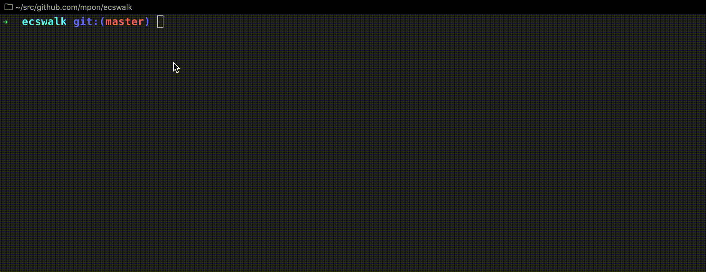

# ecswalk

Show information for Amazon Elastic Container Service(ECS) like the AWS management console.

## Usage



### show ECS services by selecting cluster interactively

```bash
ecswalk services
```

### show ECS tasks by selecting cluster and service interactively

```bash
ecswalk tasks
```

### Get Information from ECS

#### get ECS clusters

```bash
ecswalk get clusters
```

#### get ECS services for specified ECS cluster

```bash
ecswalk get service -c default
```

#### get ECS tasks for specified ECS cluster and service

```bash
ecswalk get tasks -c default -s web-service
```

## Install

```bash
go get github.com/mpon/ecswalk
```

or

Download from [GitHub Releases](https://github.com/mpon/ecswalk/releases)

## Options

You can set aws profile by `.ecswalk.yaml` or `$HOME/.ecswalk.yaml`.

```yaml
profile: my-aws
```

or pass config to command.

```bash
ecswalk --config conf.yaml
```

## Create Test Environment

You can create by terraform [github.com/mpon/infra/ecswalk_test](https://github.com/mpon/infra/tree/master/terraform/ecswalk_test).

## TODO

- [x] List ECS services
- [x] List ECS tasks
- [x] List ECS container instances
- [ ] List ECS services and fuzzy find
